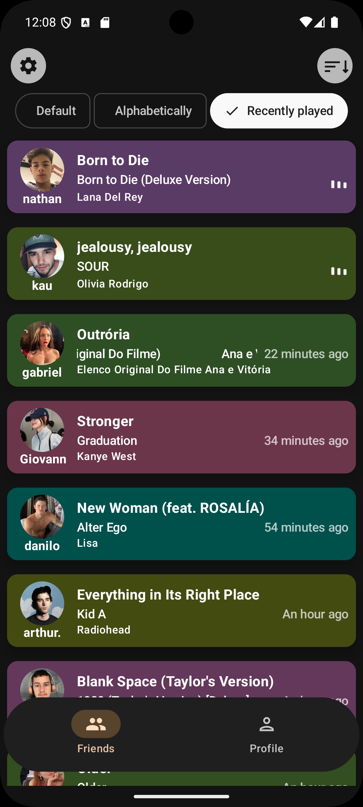

# Jamscope 🎵
<p align="center">
  
</p>

Jamscope is an open-source Android application built with Kotlin and Jetpack Compose. It connects to
your [Last.fm](https://www.last.fm) account and lets you track what your friends are listening to —
right from the app's home screen or even your home screen through a widget.

<p align="center">
  <table>
    <tr>
      <td>
        
      </td>
      <td>
        
      </td>
      <td>
        <br>
        <br>
        
      </td>
    </tr>
  </table>
</p>

## 📲 Download

[](https://github.com/muriloonunes/jamscope/releases)

## 🚀 Features

- 🚫 No ads.
- 🔍 View your friends' current or recent listening activity.
- 📱 Add a widget to your home screen showing what your friend is listening to.
- 🔎 See your recent played tracks.
- 🎨 Material You support (Android 12+ dynamic theming).
- 🌙 Light/Dark theme support.
- 📡 Uses Last.fm's public API (requires a Last.fm account).

## 🔐 Privacy Notice

Jamscope uses the Last.fm API to access user listening activity. Here are the key points regarding
user privacy:

- The app **does not store or share personal data externally**.
- Login credentials are securely saved **locally on the device**, using **encrypted storage**.
- The app includes a WebView. Please note that WebView may internally handle cookies or cache as
  part of the Android system — **Jamscope does not collect or transmit this data**.

## 🧾 Credits

- Inspiration from many apps that used spotify to do the same thing.
- [Last.fm](https://www.last.fm) for the API.
- [Pano Scrobbler](https://github.com/kawaiiDango/pano-scrobbler/) — a more feature-rich Last.fm
  client that inspired this project. Some of its open-source code was used directly or served as a
  reference, with attribution noted in the codebase. Huge thanks
  to [kawaiiDango](https://github.com/kawaiiDango) for their amazing work!
- All open-source libraries used.

## ❗ Disclaimer

This project is not affiliated with Last.fm.

## 📃 License

This project is licensed under the [GNU General Public License v3.0](LICENSE.txt).

## 🔨 Building

1. Clone this repository (you can also import it directly into Android Studio):
   ```bash
   git clone https://github.com/muriloonunes/jamscope.git
   ```
2. Open the project in Android Studio.
3. Go to `app/src/main/java/com/mno/jamscope/data/model` and create a file Token.kt
    ```kotlin
    object Token {
        const val LAST_FM_API_KEY = ""
        const val LAST_FM_SECRET = ""
    }
    ```
4. Create your own [API Key and secret](https://www.last.fm/api/account/create) and add them to this
   file.
5. Build and run the app on an emulator or physical device.